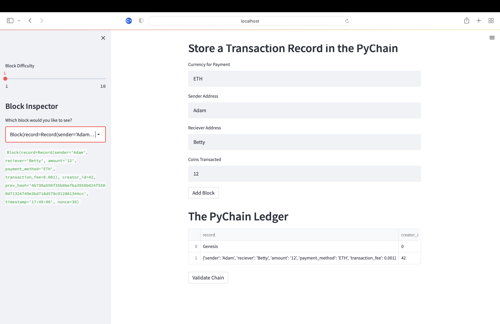
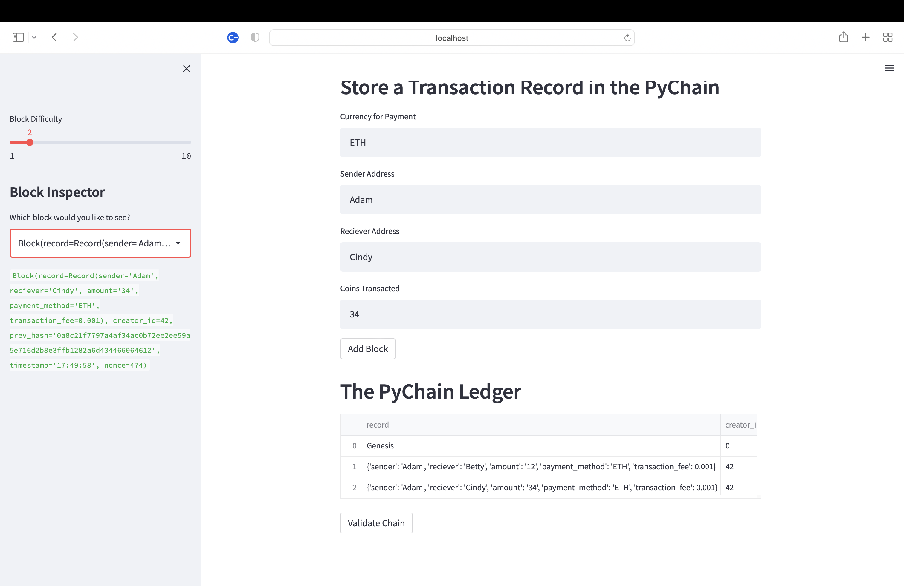
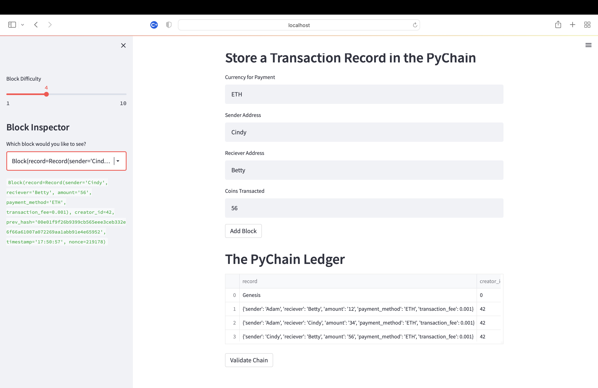
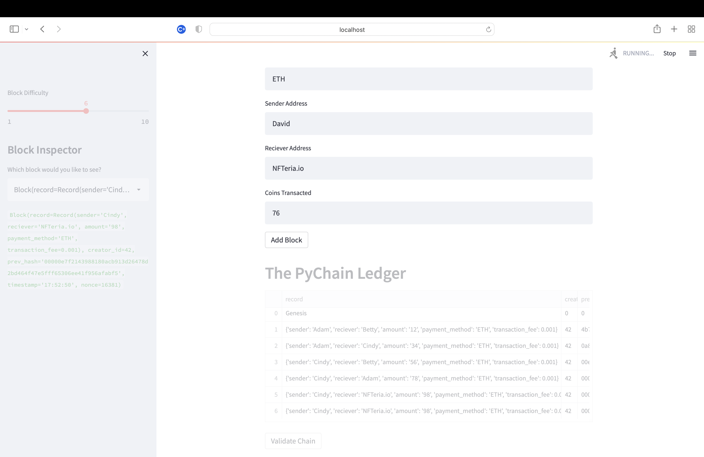
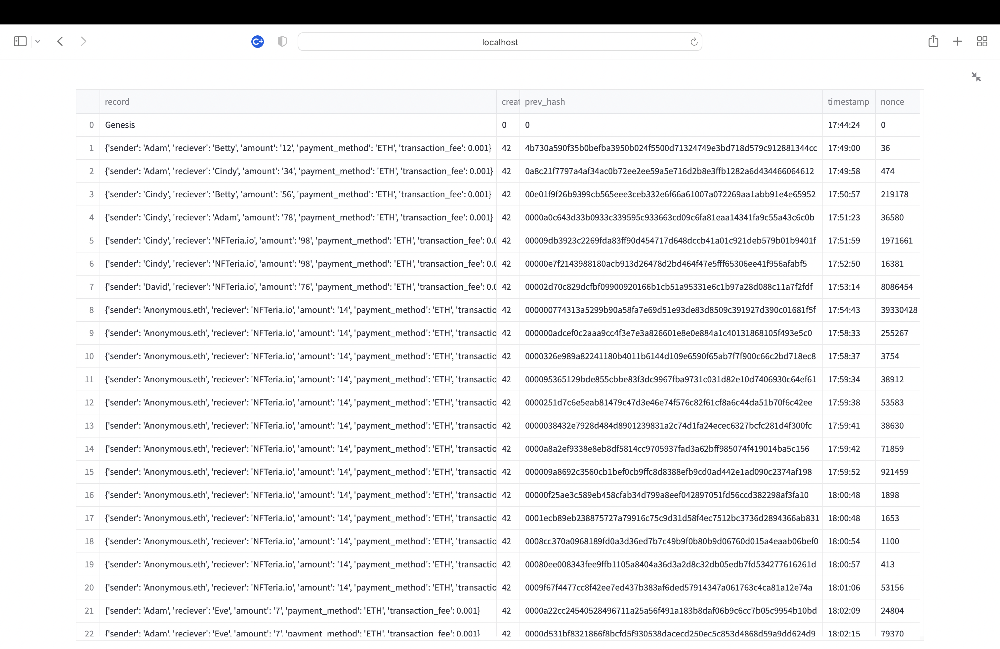
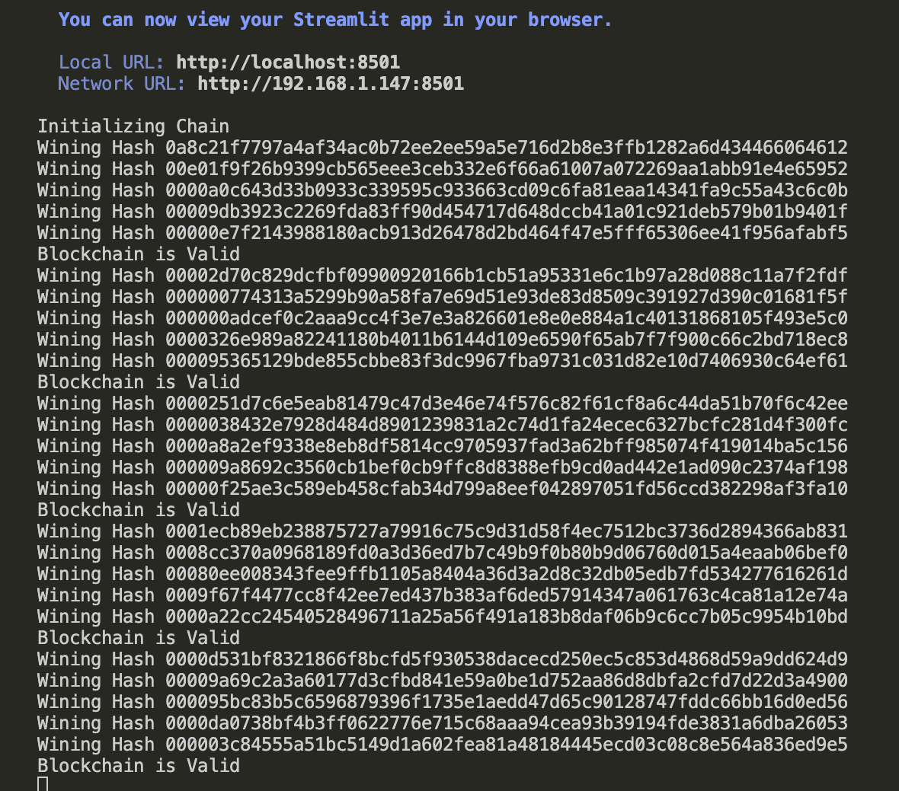

# Blockchain_with_Python

Instructions
Open the pychain.py file that your git cloned files include. You’ll use this file to complete the steps for this application.

## The steps for this application are divided into the following sections:

   * Create a Record Data Class  

   * Modify the Existing Block Data Class to Store  

   * Record Data  

   * Add Relevant User Inputs to the Streamlit Interface  

## Test the PyChain Ledger by Storing Records  

# Step 1: Create a Record Data Class  

Define a new Python data class named Record. Give this new class a formalized data structure that consists of the sender, receiver, and amount attributes. To do so, complete the following steps:

Define a new class named Record.

   * Add the @dataclass decorator immediately before the Record class definition.

   * Add an attribute named sender of type str.

   * Add an attribute named receiver of type str.

   * Add an attribute named amount of type float.

Note that you’ll use this new Record class as the data type of your record attribute in the next section.

## Step 2: Modify the Existing Block Data Class to Store Record Data
Rename the data attribute in your Block class to record, and then set it to use an instance of the new Record class that you created in the previous section. To do so, complete the following steps:

In the Block class, rename the data attribute to record.

Set the data type of the record attribute to Record.

Step 3: Add Relevant User Inputs to the Streamlit Interface
Code additional input areas for the user interface of your Streamlit application. Create these input areas to capture the sender, receiver, and amount for each transaction that you’ll store in the Block record. To do so, complete the following steps:

   * Delete the input_data variable from the Streamlit interface.

   * Add an input area where you can get a value for sender from the user.

   * Add an input area where you can get a value for receiver from the user.

   * Add an input area where you can get a value for amount from the user.

As part of the Add Block button functionality, update new_block so that Block consists of an attribute named record, which is set equal to a Record that contains the sender, receiver, and amount values. The updated Blockshould also include the attributes for creator_id and prev_hash.

## Step 4: Test the PyChain Ledger by Storing Records
Test your complete PyChain ledger and user interface by running your Streamlit application and storing some mined blocks in your PyChain ledger. Then test the blockchain validation process by using your PyChain ledger. To do so, complete the following steps:

In the terminal, navigate to the project folder where you've coded the Challenge.

In the terminal, run the Streamlit application by using streamlit run pychain.py.

Enter values for the sender, receiver, and amount, and then click the Add Block button. Do this several times to store several blocks in the ledger.

Verify the block contents and hashes in the Streamlit drop-down menu. Take a screenshot of the Streamlit application page, which should detail a blockchain that consists of multiple blocks. Include the screenshot in the README.md file for your Challenge repository.

Test the blockchain validation process by using the web interface. Take a screenshot of the Streamlit application page, which should indicate the validity of the blockchain. Include the screenshot in the README.md file for your Challenge repository.

### *First transaction running shows `Genesis block` `difficulty of 1` `about 40 seconds`:* 

 

### *Transaction hash mined creating `Second link in chain` `difficulty of 2`:* 

 

### *Third link in chain `difficulty of 4` about 5 seconds to find hash:* 

 

### *Customer sending payment `Difficulty of 6` about `8 minutes to get winning Hash`:* 

 

### *Blockchain `ledger from the streamlit` app:* 

 

### *This is the `Winning hash ledger from computer terminal` Validating the chain every five transactions:* 

 

* Went up to `difficulty of 8` and `after two hours I stopped the hashing`. For research purpose will limit to difficulty of 6 for this repository.  

* I made the same transaction times over to display how every transcation is unique due to timestamp and nonce.  

* Returning customers sending Eth to different businesses and private wallets.  

* Block difficulty limits were coded to raise the `max difficulty to 10` and the `standard diffiuclty set at 4`  

## Contributor

Rensley Ramos - ranly196@gmail.com, https://www.linkedin.com/in/rensley-2-nfty/

